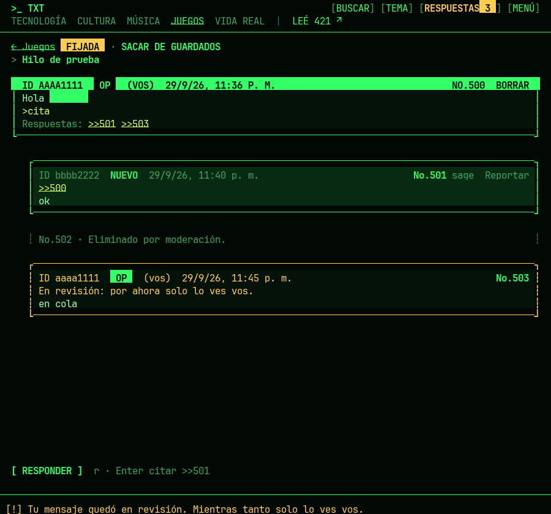
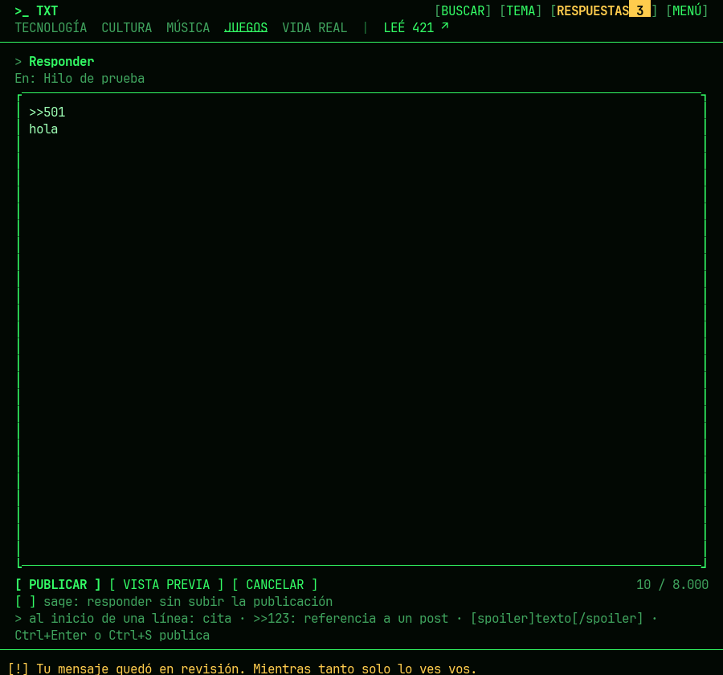

# txt421

Cliente de terminal para [txt.421.news](https://txt.421.news), el foro de texto de [421](https://www.421.news).
Se ve como el sitio (los mismos colores, fichas, mensajes y temas), se maneja con las flechas y
no tiene scroll: todo va en páginas del tamaño de la ventana. Se puede leer, publicar, responder,
guardar, reportar y borrar lo propio, igual que en la web.



## Instalar

Un solo comando, sin instalar nada más:

**macOS y Linux**

```sh
curl -fsSL https://raw.githubusercontent.com/piojosso/txt421/main/install.sh | sh
```

**Windows** (PowerShell)

```powershell
irm https://raw.githubusercontent.com/piojosso/txt421/main/install.ps1 | iex
```

Después, en una terminal nueva: `txt421`. Para actualizar: `txt421 actualizar` (o Menú →
Actualizar, que aparece cuando hay una versión nueva).

El instalador baja el ejecutable de la última versión de
[Releases](https://github.com/piojosso/txt421/releases), verifica su checksum y lo deja en
`~/.local/bin` (macOS/Linux) o en `%LOCALAPPDATA%\Programs\txt421` (Windows), agregando esa
carpeta al PATH si hace falta. También se pueden bajar los archivos a mano desde Releases.

## Usar

```
txt421                 la portada
txt421 1542            la publicación 1542 (vale pegar el link)
txt421 b juegos        una sección
txt421 buscar texto    buscar
txt421 respuestas      tus respuestas
txt421 entrar          entrar con Google
```

| Tecla | Qué hace |
|---|---|
| Flechas | moverse entre fichas y mensajes |
| Enter | abrir; en un mensaje, responderle (agrega `>>N`) |
| ← → · PgUp PgDn | páginas |
| Tab · 0–5 | secciones (0 = portada) |
| Esc | volver |
| `n` | publicar |
| `r` | responder |
| `i` | ir al mensaje citado (`>>N`); Esc vuelve |
| `g` | guardar la publicación |
| `x` | reportar (o borrar, si es tuyo) |
| `s` | destapar el spoiler |
| `v` | vista catálogo / lista |
| `/` | buscar |
| `m` | menú (Respuestas, Guardados, Preferencias, Normas…) |
| `t` | tema (oscuro, claro, descanso, monocromo) |
| `?` | todas las teclas |

Al escribir: Tab pasa de campo, **Ctrl+Enter** o **Ctrl+S** publica, Ctrl+P muestra la vista
previa, Esc vuelve y guarda el borrador. El mouse también funciona.

Las publicaciones abiertas se actualizan solas cada 20 segundos, como en la web.

## Entrar

El sitio solo deja entrar con Google, y Google solo en un navegador de verdad. `txt421 entrar`
abre una ventana de Chrome, Edge, Brave o Chromium con un perfil propio de txt421; entrás como
siempre y la ventana se cierra sola. La sesión dura 30 días (lo que decide el sitio).

Si no tenés ninguno de esos navegadores, o Google no deja entrar en esa ventana, está la opción
de pegar a mano la cookie `sid` de un navegador donde ya entraste (herramientas de desarrollo →
Almacenamiento → Cookies → txt.421.news).

La sesión se guarda solo en tu computadora, en la carpeta de configuración (`~/.config/txt421`,
`~/Library/Application Support/txt421` o `%AppData%\txt421`), con permisos solo para tu usuario.
txt421 habla únicamente con txt.421.news y, para buscar actualizaciones, con github.com.

## Cómo funciona

No hay API: txt421 lee el mismo HTML que ve el navegador y publica con los mismos formularios,
así que todo pasa por las mismas normas, el mismo filtro y los mismos límites que la web
(30 segundos entre mensajes, 10 minutos entre publicaciones). El código del sitio es abierto:
[github.com/421news/txt](https://github.com/421news/txt).

Hecho en Go con [Bubble Tea](https://github.com/charmbracelet/bubbletea). Para compilarlo:

```sh
go build ./cmd/txt421
go test ./...
```

`TXT421_BASE` apunta a otro servidor (por ejemplo, uno local del código del sitio) y
`TXT421_LANG=en` pone la interfaz en inglés.

---

## English

txt421 is a terminal client for [txt.421.news](https://txt.421.news), 421's text-only forum. It
looks like the website, is driven with the arrow keys, and pages instead of scrolling. You can
read, post, reply, save, report and delete your own messages. Install with the commands above;
the interface follows your system language (Spanish or English), switchable in Preferences.
Press `?` inside the app for every key.



Licencia / License: [MIT](LICENSE). txt421 no es un producto oficial de 421. / Not an official
421 product.
